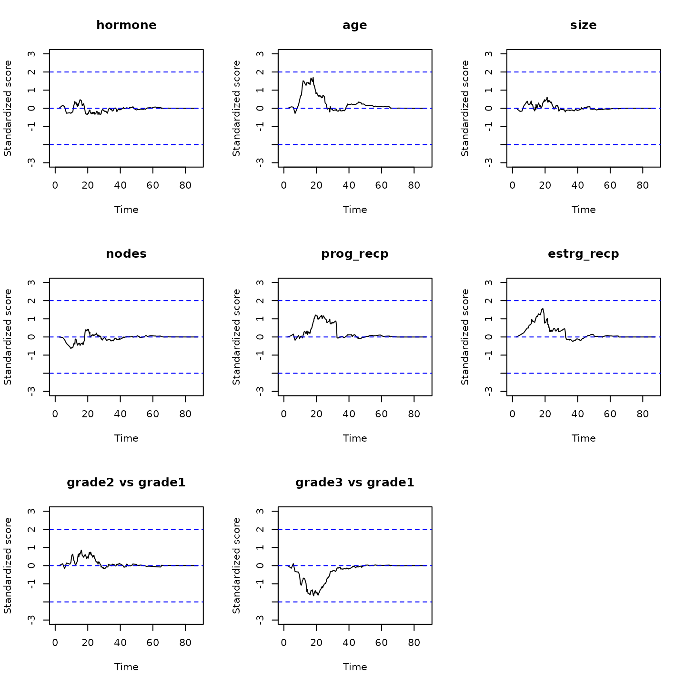

# Stratified proportional win-fractions (PW) regression of composite endpoints of death and nonfatal event

This vignette demonstrates the use of the `WR` package in fitting the
stratified proportional win-fractions (PW) regression model for
prioritized composite endpoints consisting of death and a nonfatal event
(Wang and Mao, 2022). This is an extension of the unstratified PW model
of Mao and Wang (2020, *Biometrics*).

## MODEL & INFERENCE

### Outcome data and modeling target

Let $`D`$ denote the survival time, $`T`$ time to the first nonfatal
event like hospitalization, and $`\boldsymbol Z`$ a $`p`$-vector of
covariates. The composite outcome is $`\boldsymbol Y=(D, T)`$, with
$`D`$ prioritized over $`T`$. Suppose that there are $`L`$ strata
defined by, e.g., patient demographics or study center. In the $`l`$th
stratum $`(l=1,\ldots, L)`$, if we want to compare the $`i`$th and
$`j`$th patients, denoted respectively using subscripts $`li`$ and
$`lj`$, we can use Pocock et al.’s (2012) sequential rule with the “win
indicator” defined by
``` math
\begin{align*}
\mathcal W(\boldsymbol Y_{li}, \boldsymbol Y_{lj})(t) 
& = I(\mbox{subject $i$ wins against subject $j$ by $t$ in stratum $l$})\\ 
& = I(D_{lj} < D_{li} \wedge t) + I(D_{li} \wedge D_{lj} > t, T_{lj} < T_{li} \wedge t),
\end{align*}
```
where $`a\wedge b=\min(a,b)`$. Then, the (time-dependent)
covariate-specific win ratio in the $`l`$th stratum is
``` math
\mathcal R_l(t;\boldsymbol Z_{li}, \boldsymbol Z_{lj}):=
\frac{E\{\mathcal W(\boldsymbol Y_{li}, \boldsymbol Y_{lj})(t)\mid \boldsymbol Z_{li}, \boldsymbol Z_{lj}\}}{E\{\mathcal W(\boldsymbol Y_{lj}, \boldsymbol Y_{li})(t)\mid \boldsymbol Z_{li}, \boldsymbol Z_{lj}\}}.
```

### Model specification

The stratified PW model specifies that \$\$\begin{equation}\tag{1}
\mbox{Stratified PW:}\hspace{3mm} \mathcal R_l(t;\boldsymbol Z\_{li},
\boldsymbol Z\_{lj})=\exp\\\boldsymbol\beta^{\rm T}(\boldsymbol Z\_{li}
-\boldsymbol Z\_{lj})\\,\hspace{3mm} l=1,\ldots, L. \end{equation}\$\$
That is, we assume that the covariate-specific win ratio in each stratum
is invariant to the follow-up time (proportionality of the win
fractions) and depends on a common regression parameter
$`\boldsymbol\beta`$. Under model (1), the components of
$`\boldsymbol\beta`$ can be interpreted as the log-win ratios associated
with unit increases in the corresponding covariates *within each
stratum*. Because model (1) involves only within-stratum comparisons, it
does not require proportionality to hold across strata as an
unstratified PW model does.

### Number of strata and inference procedure

Under (1), we can obtain consistent estimates for the parameter
$`\boldsymbol\beta`$ based on censored data under the independent
censoring assumption
``` math
(C_{li}\perp \boldsymbol Y_{li})\mid \boldsymbol Z_{li}.
```
for every $`l=1,\ldots, L`$. There are two approaches to estimating the
variance of the resulting estimator $`\boldsymbol\beta`$, each
appropriate in a different context. When the number of strata $`L`$ is
small, such as in the case of sex or race categories, we can apply the
variance estimator of the unstratified PW model to each stratum and sum
up the stratum-specific variances. We call this the **type I** variance
estimator. When $`L`$ is large, such as in the case of matched pairs (so
that $`L=n/2`$), each stratum need not contain enough subjects to
support its own variance estimator. We instead treat the strata as basic
units of observation and take a Lindeberg–Feller-type approach to
quantifying the variance of the sum of the independent (but not
necessarily identically distributed) units. This gives us a **type II**
variance estimator.

## BASIC SYNTAX

The input data must be in the “long format”, with an `ID` vector
containing unique patient-level identifiers. In addition, we need a
`time` vector containing the event times and a `status` vector
indicating the corresponding cause of the event. The vector `status`
should be coded as `1`=death; `2`=non-fatal event; `0`=censoring. In the
case of recurrent non-fatal events, multiple rows with `status`=2 are
allowed. However, by nature of the method, only time to the first
episode will be used. Finally, we need a covariate matrix `Z` with the
same row as `ID`. Each column of `Z` represents a covariate. All
covariates need to be time-constant.

The main function to fit the stratified PW model is

``` r

obj<-pwreg(ID, time, status, Z, strata, fixedL=TRUE) 
```

with `ID`, `time`, `status`, and `Z` as specified above. The optional
argument `strata` accepts the (categorical) stratifying variable. The
default option `fixedL=TRUE` requests the type I variance estimator
(under small $`L`$) while `fixedL=FALSE` requests the type II variance
estimator (under large $`L`$). The function returns an object of class
`pwreg` with a `beta` vector for $`\widehat{\boldsymbol\beta}`$ and a
`Var` matrix for $`\text{var}(\widehat{\boldsymbol\beta})`$. Score
processes to check the proportionality assumption can be computed and
plotted by

``` r

## compute the standardized score processes
score<-score.proc(obj)
## plot the computed process for the kth covariate
plot(score, k)
```

As a rule of thumb, we consider the proportionality to be tenable if the
score processes are bounded in $`[-2, 2]`$.

## AN EXAMPLE WITH THE GERMAN BREAST CANCER STUDY

We demonstrate the stratified PW regression methods using a subset of
the data from the German Breast Cancer study consisting of 686 patients
with primary node positive breast cancer (Sauerbrei et al., 1999).

### Data preparation

The study was conducted between July 1984 to December 1989 to assess the
effectiveness of hormonal treatment with tamoxifen in addition to
standard chemotherapy in reducing the cancer relapse (nonfatal event)
and mortality of patients.

We first load the `WR` package and the analysis dataset `gbc`.

``` r

library(WR)
head(gbc)
#>   id     time status hormone age menopause size grade nodes prog_recp
#> 1  1 43.83607      2       1  38         1   18     3     5       141
#> 2  1 74.81967      0       1  38         1   18     3     5       141
#> 3  2 46.55738      2       1  52         1   20     1     1        78
#> 4  2 65.77049      0       1  52         1   20     1     1        78
#> 5  3 41.93443      2       1  47         1   30     2     1       422
#> 6  3 47.73770      1       1  47         1   30     2     1       422
#>   estrg_recp
#> 1        105
#> 2        105
#> 3         14
#> 4         14
#> 5         89
#> 6         89
```

Covariates include:

- `hormone`: Treatment indicator: 1=Hormone therapy; 2=standard therapy;
- `age` Age at diagnosis (years)
- `menopause` Menopausal Status; 1=No; 2=Yes
- `grade` Tumor grade, 1-3
- `nodes` Number of nodes involved
- `prog_recp` Number of progesterone receptors
- `estrg_recp` Number of estrogen receptors

The `grade` column in `gbc` is a factor variable. We create dummy
variables for `grade`.

``` r

grade_matrix <- model.matrix(~factor(grade),data=gbc)
grade_df <- as.data.frame(grade_matrix[,-1])
names(grade_df) <- c("grade2 vs grade1", "grade3 vs grade1")
gbc <- cbind.data.frame(gbc[,-8], grade_df)
```

### Stratification by menopause status

Next, we fit a PW model stratified by menopause status. Because the
stratifying variable has only two levels, we use the type I variance
estimator.

``` r

## extract the covariate matrix Z from the data
## leaving out menopause as the stratifying variable
Z1 <- as.matrix(gbc[,c("hormone", "age", "size", "nodes", "prog_recp",
                       "estrg_recp", "grade2 vs grade1", "grade3 vs grade1")])

## fit a PW model stratified by the binary menopause status
## use type I variance estimator
obj1<-pwreg(ID=gbc$id,time=gbc$time,status=gbc$status, Z=Z1,strata=gbc$menopause,fixedL=TRUE)
## print out the results
print(obj1)
#> Call:
#> pwreg(ID = gbc$id, time = gbc$time, status = gbc$status, Z = Z1, 
#>     strata = gbc$menopause, fixedL = TRUE)
#> 
#> Stratified proportional win-fractions regression analysis
#> 
#>     (Wang and Mao, 2021+):
#> 
#> Total number of strata: 2 
#> Newton-Raphson algorithm converged in 6 iterations.
#> 
#> Overall test: chisq test with 8 degrees of freedom; 
#>  Wald statistic 96 with p-value 0 
#> 
#> Estimates for Regression parameters:
#>                     Estimate          se z.value   p.value    
#> hormone           4.2232e-01  1.4207e-01  2.9726  0.002953 ** 
#> age               1.2849e-02  9.9410e-03  1.2925  0.196175    
#> size             -1.0653e-02  4.6504e-03 -2.2909  0.021971 *  
#> nodes            -8.0716e-02  1.5057e-02 -5.3607 8.288e-08 ***
#> prog_recp         2.4843e-03  6.1486e-04  4.0404 5.337e-05 ***
#> estrg_recp       -6.8751e-05  5.1367e-04 -0.1338  0.893527    
#> grade2 vs grade1 -6.5226e-01  2.5633e-01 -2.5447  0.010938 *  
#> grade3 vs grade1 -8.5797e-01  2.8480e-01 -3.0126  0.002590 ** 
#> ---
#> Signif. codes:  0 '***' 0.001 '**' 0.01 '*' 0.05 '.' 0.1 ' ' 1
#> 
#> 
#> Point and interval estimates for the win ratios:
#>                  Win Ratio 95% lower CL 95% higher CL
#> hormone          1.5254939    1.1547326     2.0152991
#> age              1.0129319    0.9933870     1.0328614
#> size             0.9894031    0.9804261     0.9984623
#> nodes            0.9224554    0.8956306     0.9500837
#> prog_recp        1.0024873    1.0012800     1.0036962
#> estrg_recp       0.9999313    0.9989250     1.0009385
#> grade2 vs grade1 0.5208648    0.3151662     0.8608161
#> grade3 vs grade1 0.4240199    0.2426418     0.7409807
```

We can see that, adjusting for other variables and stratifying by
menopause status, hormonal treatment makes the patient 1.5 times as
likely to have a more favorable outcome (prioritizing survival over
cancer relapse), with 95% confidence interval (1.2, 2.0) and $`p`$-value
0.003. Next, plot the standardized score process for each covariate:

``` r

score1 <- score.proc(obj1)
oldpar <- par(mfrow = par("mfrow"))
par(mfrow = c(3,3))
for(i in c(1:8)){
  plot(score1, k = i)
  abline(h = 0, col="blue",lty=2)
  abline(h = -2, col="blue",lty=2)
  abline(h =  2, col="blue",lty=2)
}
par(oldpar)
```

 All curves
are bounded between -2 and 2, suggesting no severe violation of the
proportionality assumption.

### Stratification by age

As illustration, we fit another PW model stratified by finely-cut age
groups.

``` r

## cut age into ~30 groups by quantiles
cutpoints <- c(0,unique(quantile(gbc$age[gbc$status<2],
                        seq(0.1,1,by=0.02))),Inf)
cutpoints
#>  [1]  0.0 40.0 41.2 43.0 44.0 45.0 46.0 47.0 48.0 49.0 50.0 51.0 52.0 53.0 54.0
#> [16] 55.0 56.0 57.0 58.0 59.0 60.0 61.0 62.0 63.0 64.0 65.0 66.0 67.0 69.0 71.0
#> [31] 80.0  Inf
age_group <- cut(gbc$age, breaks = cutpoints, right = FALSE)
```

Now that $`L>30`$, it would be better to use type II variance estimator
for inference.

``` r

## extract the covariate matrix Z from the data
## leaving out age as the stratifying variable
Z2 <- as.matrix(gbc[,c("hormone", "menopause", "size", "nodes", "prog_recp",
                       "estrg_recp", "grade2 vs grade1", "grade3 vs grade1")])

## fit a PW model stratified by the binary menopause status
## use type II variance estimator because L is large
obj2<-pwreg(ID=gbc$id,time=gbc$time,status=gbc$status, Z=Z2,strata=age_group,fixedL=TRUE)
## print out the results
print(obj2)
#> Call:
#> pwreg(ID = gbc$id, time = gbc$time, status = gbc$status, Z = Z2, 
#>     strata = age_group, fixedL = TRUE)
#> 
#> Stratified proportional win-fractions regression analysis
#> 
#>     (Wang and Mao, 2021+):
#> 
#> Total number of strata: 31 
#> Newton-Raphson algorithm converged in 6 iterations.
#> 
#> Overall test: chisq test with 8 degrees of freedom; 
#>  Wald statistic 75.4 with p-value 4.168887e-13 
#> 
#> Estimates for Regression parameters:
#>                     Estimate          se z.value   p.value    
#> hormone           4.8641e-01  1.5611e-01  3.1158 0.0018346 ** 
#> menopause        -2.1619e-02  2.7309e-01 -0.0792 0.9369026    
#> size             -1.1571e-02  5.0177e-03 -2.3060 0.0211088 *  
#> nodes            -7.5957e-02  1.7082e-02 -4.4466 8.724e-06 ***
#> prog_recp         2.3739e-03  6.4165e-04  3.6996 0.0002159 ***
#> estrg_recp       -6.9157e-05  6.0552e-04 -0.1142 0.9090710    
#> grade2 vs grade1 -6.3031e-01  2.9273e-01 -2.1532 0.0313009 *  
#> grade3 vs grade1 -8.0426e-01  3.2323e-01 -2.4882 0.0128400 *  
#> ---
#> Signif. codes:  0 '***' 0.001 '**' 0.01 '*' 0.05 '.' 0.1 ' ' 1
#> 
#> 
#> Point and interval estimates for the win ratios:
#>                  Win Ratio 95% lower CL 95% higher CL
#> hormone          1.6264589    1.1977373     2.2086384
#> menopause        0.9786135    0.5730061     1.6713335
#> size             0.9884957    0.9788219     0.9982650
#> nodes            0.9268558    0.8963381     0.9584125
#> prog_recp        1.0023767    1.0011169     1.0036381
#> estrg_recp       0.9999308    0.9987448     1.0011183
#> grade2 vs grade1 0.5324247    0.2999756     0.9449969
#> grade3 vs grade1 0.4474189    0.2374532     0.8430446
```

We can see that the results are similar to those of the
menopause-stratified analysis. One can also check the proportionality
assumption in a similar way using the
[`score.proc()`](https://lmaowisc.github.io/WR/reference/score.proc.md)
function.

## References

- Mao, L. and Wang, T. (2020). A class of proportional win-fractions
  regression models for composite outcomes. *Biometrics*,
  <https://doi.org/10.1111/biom.13382>.

- Pocock, S., Ariti, C., Collier, T., and Wang, D. (2012). The win
  ratio: a new approach to the analysis of composite endpoints in
  clinical trials based on clinical priorities. *European Heart
  Journal*, 33, 176–182.

- Sauerbrei, W., Royston, P., Bojar, H., Schmoor, C., & Schumacher, M.
  (1999). Modelling the effects of standard prognostic factors in
  node-positive breast cancer. German Breast Cancer Study Group (GBSG).
  *British Journal of Cancer*, 79, 1752–1760.

- Wang, T. and Mao, L. (2022). Stratified Proportional Win-fractions
  Regression Analysis.
