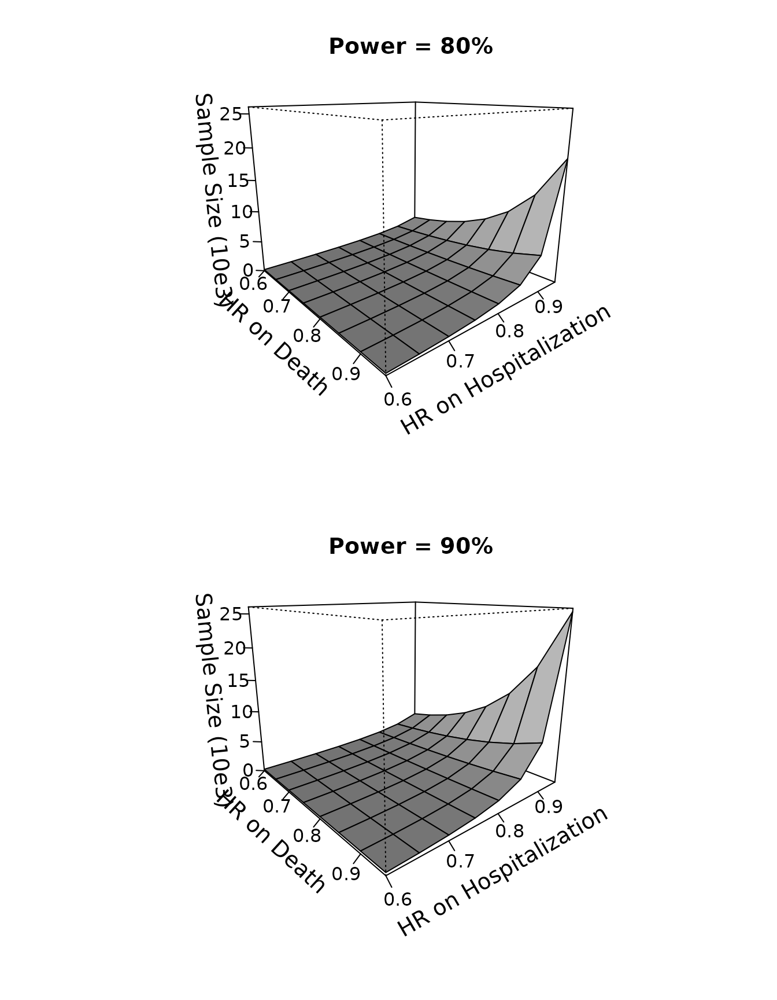

# Sample size calculation for standard win ratio test

## INTRODUCTION

This vignette demonstrates the use of the `WR` package in sample size
calculation for standard win ratio test of death and nonfatal event
using component-wise hazard ratios as effect size (Mao et al., 2021,
*Biometrics*).

### Data and the test

Let $`D^{(a)}`$ denote the survival time and $`T^{(a)}`$ the first
nonfatal event time of a patient in group $`a`$, where $`a=1`$ indicates
the active treatment and $`a=0`$ indicates the control. Likewise, use
$`C^{(a)}`$ to denote the independent censoring time. In the standard
win ratio of Pocock et al. (2012), the “win” indicator at time $`t`$ can
be written as
``` math
\mathcal W(D^{(a)},T^{(a)}; D^{(1-a)},T^{(1-a)})(t)=
I(D^{(1-a)}<D^{(a)}\wedge t)+I(D^{(a)}\wedge D^{(1-a)}>t, T^{(1-a)}<T^{(a)}\wedge t),
```
where $`b\wedge c=\min(b, c)`$. So the winner goes to the longer overall
survivor or, if both survive past $`t`$, the longer event-free survivor.
Tweaks to this rule to incorporate recurrent event are considered in Mao
et al. (2022).

Using this notation, Pocock’s win ratio statistic becomes
``` math
\begin{equation}\tag{1}
S_n=\frac{\sum_{i=1}^{n_1}\sum_{j=1}^{n_0}\mathcal W(D_i^{(1)},T_i^{(1)}; D_j^{(0)},T_j^{(0)})
(C_i^{(1)}\wedge C_j^{(0)})}
{\sum_{i=1}^{n_1}\sum_{j=1}^{n_0}\mathcal W(D_j^{(0)},T_j^{(0)}; D_i^{(1)},T_i^{(1)})
(C_i^{(1)}\wedge C_j^{(0)})},
\end{equation}
```
where the $`(D_i^{(a)}, T_i^{(a)}, C_i^{(a)})`$$`(i=1,\ldots, n_a)`$ are
a random $`n_a`$-sample of $`(D^{(a)}, T^{(a)}, C^{(a)})`$$`(a=1, 0)`$
(the right hand side of (1) is indeed computable with censored data). A
two-sided level-$`\alpha`$ win test of group difference rejects the null
if $`n^{1/2}|\log S_n|/\widehat\sigma_n>z_{1-\alpha/2}`$, where
$`n=n_1+n_0`$, $`\widehat\sigma_n^2`$ is a consistent variance
estimator, and $`z_{1-\alpha/2}`$ is the $`(1-\alpha/2)`$th quantile of
the standard normal distribution. Mao (2019) showed that this test is
powerful in large samples if the treatment stochastically delays death
and the nonfatal event jointly.

### Methods for sample size calculation

To simplify sample size calculation, we posit a Gumbel–Hougaard copula
model with marginal proportional hazards structure for $`D^{(a)}`$ and
$`T^{(a)}`$:
``` math
\begin{equation}\tag{2}
{P}(D^{(a)}>s, T^{(a)}>t) =\exp\left(-\left[\left\{\exp(a\xi_1)\lambda_Ds\right\}^\kappa+
\left\{\exp(a\xi_2)\lambda_Ht\right\}^\kappa\right]^{1/\kappa}\right),
\end{equation}
```
where $`\lambda_D`$ and $`\lambda_H`$ are the baseline hazards for death
and the nonfatal event, respectively, and $`\kappa\geq 1`$ controls
their correlation (with Kendall’s concordance $`1-\kappa^{-1}`$). The
parameters \$\boldsymbol\xi:=(\xi_1,\xi_2)^{\rm T}\$ are the
component-wise *log*-hazard ratios comparing the treatment to control,
and will be used an the effect size in sample size calculation. Further
assume that patients are recruited to the trial uniformly in an initial
period $`[0, \tau_b]`$ and followed up until time
$`\tau`$$`(\tau\geq \tau_b)`$, during which they randomly drop out with
an exponential hazard rate of $`\lambda_L`$. This leads to
$`C^{(a)}\sim\mbox{Unif}[\tau-\tau_b,\tau]\wedge\mbox{Expn}(\lambda_L)`$.
The outcome parameters $`\lambda_D, \lambda_H`$, and $`\kappa`$ may be
estimated from pilot study data if available (see Section 3.2 of Mao et
al. (2021)), whereas the design parameters $`\tau_b, \tau,`$ and perhaps
$`\lambda_L`$ are best elicited from investigators of the new trial.

The basic sample size formula is \$\$\begin{equation}\tag{3}
n=\frac{\zeta_0^2(z\_{1-\beta}+z\_{1-\alpha/2})^2}{q(1-q)(\boldsymbol\delta_0^{\rm
T}\boldsymbol\xi)^2}, \end{equation}\$\$ where $`q=n_1/n`$, $`1-\beta`$
is the target power, $`\zeta_0`$ is a noise parameter similar to the
standard deviation in the $`t`$-test, and $`\boldsymbol\delta_0`$ is a
bivariate vector containing the derivatives of the true win ratio with
respect to $`\xi_1`$ and $`\xi_2`$. Under model (2) for the outcomes and
the specified follow-up design, we can calculate $`\zeta_0^2`$ and
$`\boldsymbol\delta_0`$ as functions of
$`\lambda_D, \lambda_H, \kappa, \tau_b, \tau`$, and $`\lambda_L`$ by
numerical means. Note in particular that they do *not* depend on the
effect size $`\boldsymbol\xi`$.

## BASIC SYNTAX

The function that implements formula (3) is
[`WRSS()`](https://lmaowisc.github.io/WR/reference/WRSS.md). We need to
supply at least two arguments: `xi` for the bivariate effect size
$`\boldsymbol\xi`$ (*log*-hazard ratios) and a list `bparam` containing
`zeta2` for $`\zeta_0^2`$ and `delta` for $`\boldsymbol\delta_0`$. That
is,

``` r

obj<-WRSS(xi,bparam)
```

The calculated $`n`$ can be extracted from `obj$n`. The default
configurations for $`q`$, $`\alpha`$ and $`1-\beta`$ are 0.5, 0.05, and
0.8 but can nonetheless be overridden through optional arguments `q`,
`alpha`, and `power`, respectively. You can also change the default
two-sided test to one-sided by specifying `side=1`.

The function [`WRSS()`](https://lmaowisc.github.io/WR/reference/WRSS.md)
itself is almost unremarkable given the simplicity of the underlying
formula. What takes effort is the computation of $`\zeta_0^2`$ and
$`\boldsymbol\delta_0`$ needed for `bparam`. If you have the parameters
$`\lambda_D, \lambda_H, \kappa, \tau_b, \tau`$, and $`\lambda_L`$ ready,
you can do so by using the
[`base()`](https://lmaowisc.github.io/WR/reference/base.md) function:

``` r

bparam<-base(lambda_D,lambda_H,kappa,tau_b,tau,lambda_L)
```

where the arguments follow the order of the said parameters. The
returned object `bparam` can be directly used as argument for
[`WRSS()`](https://lmaowisc.github.io/WR/reference/WRSS.md) (it is
precisely a list containing `zeta2` and `delta` for the computed
$`\zeta_0^2`$ and $`\boldsymbol\delta_0`$, respectively). Due to the
numerical complexity,
[`base()`](https://lmaowisc.github.io/WR/reference/base.md) will
typically require some wait time.

Finally, if you have a pilot dataset to estimate $`\lambda_D`$,
$`\lambda_H`$, and $`\kappa`$ for the baseline outcome distribution, you
can use the
[`gumbel.est()`](https://lmaowisc.github.io/WR/reference/gumbel.est.md)
function:

``` r

gum<-gumbel.est(id, time, status)
```

where `id` is a vector containing the unique patient identifiers, `time`
a vector of event times, and `status` a vector of event type labels:
`status=2` for nonfatal event, `=1` for death, and `=0` for censoring.
The returned object is a list containing real numbers `lambda_D`,
`lambda_H`, and `kappa` for $`\lambda_D`$, $`\lambda_H`$, and $`\kappa`$
respectively. These can then be fed into
[`base()`](https://lmaowisc.github.io/WR/reference/base.md) to get
`bparam`.

## A REAL EXAMPLE

We demonstrate the use of the above functions in calculating sample size
for win ratio analysis of death and hospitalization using baseline
parameters estimated from a previous cardiovascular trial.

### Pilot data description

The Heart Failure: A Controlled Trial Investigating Outcomes of Exercise
Training (HF-ACTION) trial was conducted on a cohort of over two
thousand heart failure patients recruited between 2003–2007 across the
USA, Canada, and France (O’Connor et al., 2009). The study aimed to
assess the effect of adding aerobic exercise training to usual care on
the patient’s composite endpoint of all-cause death and all-cause
hospitalization. We consider a high-risk subgroup consisting of 451
study patients. For detailed information about this subgroup, refer to
the vignette *Two-sample win ratio tests of recurrent event and death*.

We first load the package and clean up the baseline dataset for use.

``` r

## load the package
library(WR)
## load the dataset
data(hfaction_cpx9)
dat<-hfaction_cpx9
head(dat)
#>        patid       time status trt_ab age60
#> 1 HFACT00001  7.2459016      2      0     1
#> 2 HFACT00001 12.5573770      0      0     1
#> 3 HFACT00002  0.7540984      2      0     1
#> 4 HFACT00002  4.2950820      2      0     1
#> 5 HFACT00002  4.7540984      2      0     1
#> 6 HFACT00002 45.9016393      0      0     1
## subset to the control group (usual care)
pilot<-dat[dat$trt_ab==0,]
```

### Use pilot data to estimate baseline parameters

Now, we can use the
[`gumbel.est()`](https://lmaowisc.github.io/WR/reference/gumbel.est.md)
functions to estimate $`\lambda_D`$, $`\lambda_H`$, and $`\kappa`$.

``` r

id<-pilot$patid
## convert time from month to year
time<-pilot$time/12
status<-pilot$status
## compute the baseline parameters for the Gumbel--Hougaard
## copula for death and hospitalization
gum<-gumbel.est(id, time, status)
gum
#> $lambda_D
#> [1] 0.1088785
#> 
#> $lambda_H
#> [1] 0.679698
#> 
#> $kappa
#> [1] 1.925483
lambda_D<-gum$lambda_D
lambda_H<-gum$lambda_H
kappa<-gum$kappa
```

This gives us $`\widehat\lambda_D=0.11`$, $`\widehat\lambda_H=0.68`$,
and $`\widehat\kappa=1.93`$. Suppose that we are to launch a new trial
that lasts $`\tau=4`$ years, with an initial accrual period of
$`\tau_b=3`$ years. Further suppose that the loss to follow-up rate is
$`\lambda_L=0.05`$ (about half of the baseline death rate). Combining
this set-up with the estimated outcome parameters, we can calculate
$`\zeta_0^2`$ and $`\boldsymbol\delta_0`$ using the
[`base()`](https://lmaowisc.github.io/WR/reference/base.md) function.

``` r

## max follow-up 4 years
tau<-4
## 3 years of initial accrual
tau_b<-3
## loss to follow-up hazard rate
lambda_L=0.05
## compute the baseline parameters
bparam<-base(lambda_D,lambda_H,kappa,tau_b,tau,lambda_L)
bparam
#> $zeta2
#> [1] 0.2942899
#> 
#> $w0
#> [1] 0.4251441
#> 
#> $delta
#>     delta1     delta2 
#> 0.08886542 0.34018646
```

### Using `WRSS()` to compute sample size

Now we can use the computed `bparam` to calculate sample size under
different combinations of component-wise hazard ratios. We consider
target power $`1-\beta=80%`$ and $`90%`$.

``` r

## effect size specification
thetaD<-seq(0.6,0.95,by=0.05) ## hazard ratio for death
thetaH<-seq(0.6,0.95,by=0.05) ## hazard ratio for hospitalization

## create a matrix "SS08" for sample size powered at 80% 
## under each combination of thetaD and thetaH
mD<-length(thetaD)
mH<-length(thetaH)
SS08<-matrix(NA,mD,mH)
rownames(SS08)<-thetaD
colnames(SS08)<-thetaH
## fill in the computed sample size values
for (i in 1:mD){
  for (j in 1:mH){
    ## sample size under hazard ratios thetaD[i] for death and thetaH[j] for hospitalization
    SS08[i,j]<-WRSS(xi=log(c(thetaD[i],thetaH[j])),bparam=bparam,q=0.5,alpha=0.05,
                       power=0.8)$n
  }
}
## print the calculated sample sizes
print(SS08)
#>           0.6     0.65      0.7     0.75       0.8      0.85      0.9      0.95
#> 0.6  192.3437 250.7878 332.3623 450.1854  627.8914  911.4731 1400.025  2339.457
#> 0.65 205.4637 270.4621 362.6444 498.4542  708.5504 1055.3200 1681.613  2974.743
#> 0.7  218.8455 290.8172 394.5283 550.4150  797.9324 1221.1700 2025.550  3825.411
#> 0.75 232.5145 311.9056 428.1477 606.4539  897.2664 1413.3977 2450.215  4993.647
#> 0.8  246.4942 333.7800 463.6438 666.9984 1007.9865 1637.4667 2981.054  6648.349
#> 0.85 260.8071 356.4934 501.1668 732.5254 1131.7759 1900.2707 3654.047  9084.279
#> 0.9  275.4748 380.1004 540.8778 803.5685 1270.6228 2210.6027 4521.345 12852.227
#> 0.95 290.5186 404.6569 582.9505 880.7278 1426.8882 2579.8125 5660.714 19076.653

## repeating the same calculation for power = 90%
SS09<-matrix(NA,mD,mH)
rownames(SS09)<-thetaD
colnames(SS09)<-thetaH
## fill in the computed sample size values
for (i in 1:mD){
  for (j in 1:mH){
     ## sample size under hazard ratios thetaD[i] for death and thetaH[j] for hospitalization
    SS09[i,j]<-WRSS(xi=log(c(thetaD[i],thetaH[j])),bparam=bparam,q=0.5,alpha=0.05,
                       power=0.9)$n
  }
}
## print the calculated sample sizes
print(SS09)
#>           0.6     0.65      0.7      0.75       0.8     0.85      0.9      0.95
#> 0.6  257.4937 335.7337 444.9388  602.6705  840.5684 1220.204 1874.236  3131.869
#> 0.65 275.0576 362.0720 485.4779  667.2887  948.5479 1412.774 2251.203  3982.337
#> 0.7  292.9720 389.3217 528.1615  736.8496 1068.2051 1634.800 2711.636  5121.140
#> 0.75 311.2709 417.5531 573.1683  811.8697 1201.1852 1892.139 3280.143  6685.076
#> 0.8  329.9858 446.8367 620.6875  892.9217 1349.4079 2192.103 3990.786  8900.253
#> 0.85 349.1467 477.2435 670.9201  980.6437 1515.1269 2543.923 4891.732 12161.272
#> 0.9  368.7827 508.8465 724.0820 1075.7503 1701.0034 2959.370 6052.798 17205.486
#> 0.95 388.9220 541.7208 780.4053 1179.0446 1910.1985 3453.637 7578.090 25538.227
```

Powered at $`80\%`$, the sample size ranges from 193 at
\$\exp(\boldsymbol\xi)=(0.6, 0.6)^{\rm T}\$ to 19,077 at
\$\exp(\boldsymbol\xi)=(0.95, 0.95)^{\rm T}\$; powered at $`90\%`$, the
sample size ranges from 258 at \$\exp(\boldsymbol\xi)=(0.6, 0.6)^{\rm
T}\$ to 25,539 at \$\exp(\boldsymbol\xi)=(0.95, 0.95)^{\rm T}\$. We can
even use a 3D plot to display the calculated sample size as a function
of the hazard ratios $`\exp(\xi_1)`$ and $`\exp(\xi_2)`$.

``` r

oldpar <- par(mfrow = par("mfrow"))
par(mfrow=c(2,1))
persp(thetaD, thetaH, SS08/1000, theta = 50, phi = 15, expand = 0.8, col = "gray",
      ltheta = 180, lphi=180, shade = 0.75,
      ticktype = "detailed",
      xlab = "\n HR on Death", ylab = "\n HR on Hospitalization",
      zlab=paste0("\n Sample Size (10e3)"),
      main="Power = 80%",
      zlim=c(0,26),cex.axis=1,cex.lab=1.2,cex.main=1.2
)
persp(thetaD, thetaH, SS09/1000, theta = 50, phi = 15, expand = 0.8, col = "gray",
      ltheta = 180, lphi=180, shade = 0.75,
      ticktype = "detailed",
      xlab = "\nHR on Death", ylab = "\nHR on Hospitalization",
      zlab=paste0("\n Sample Size (10e3)"),
      main="Power = 90%",
      zlim=c(0,26),cex.axis=1,cex.lab=1.2,cex.main=1.2
)
```



``` r

par(oldpar)
```

## References

- Mao, L. (2019). On the alternative hypotheses for the win ratio.
  *Biometrics*, 75, 347-351. <https://doi.org/10.1111/biom.12954>.

- Mao, L., Kim, K., & Li, Y. (2022). On recurrent-event win ratio.
  *Statistical Methods in Medical Research*, under review.

- Mao, L., Kim, K., & Miao, X. (2021). Sample size formula for general
  win ratio analysis. *Biometrics*,
  <https://doi.org/10.1111/biom.13501>.

- O’Connor, C. M., Whellan, D. J., Lee, K. L., Keteyian, S. J.,
  Cooper, L. S., Ellis, S. J., Leifer, E. S., Kraus, W. E., Kitzman, D.
  W., Blumenthal, J. A. et al. (2009). “Efficacy and safety of exercise
  training in patients with chronic heart failure: HF-ACTION randomized
  controlled trial”. *Journal of the American Medical Association*, 301,
  1439–1450.

- Pocock, S., Ariti, C., Collier, T., and Wang, D. (2012). The win
  ratio: a new approach to the analysis of composite endpoints in
  clinical trials based on clinical priorities. *European Heart
  Journal*, 33, 176–182.
